# MOTORACONECT — PHASE 0: ARCHITECTURE & PLANNING

**BUY. SELL. VERIFY. IMPORT. UNDERSTAND.**

Status: Planning only. No application code has been written yet. This document is the deliverable for Phase 0. Development will not begin until the message `START PHASE 1` is received.

---

## 1. System Architecture Overview

Motoraconect is split into independently deployable apps that share code through internal packages, in a single monorepo.

```
┌─────────────────────────────┐     ┌──────────────────────────┐
│   apps/mobile (Expo/RN)     │     │   apps/web (Next.js)      │
│   Buyers, sellers, dealers  │     │   SEO marketing + listing │
└──────────────┬───────────────┘     └─────────────┬──────────────┘
               │                                    │
               │        ┌───────────────────────┐   │
               └───────▶│  packages/api (typed   │◀──┘
                        │  service layer, shared  │
                        │  between mobile & web)  │
                        └───────────┬─────────────┘
                                    │
                 ┌──────────────────┼───────────────────┐
                 ▼                  ▼                   ▼
        ┌─────────────────┐ ┌─────────────┐   ┌────────────────────┐
        │ Supabase Postgres│ │ Supabase    │   │ Supabase Edge       │
        │ + RLS            │ │ Storage     │   │ Functions           │
        │ (source of truth)│ │ (images/docs│   │ (secrets, AI calls, │
        └─────────────────┘ │ private+pub)│   │ payments, PDF gen)  │
                             └─────────────┘   └──────────┬──────────┘
                                                           │
                                              ┌────────────┴────────────┐
                                              │ External services        │
                                              │ (AI provider, payment     │
                                              │ provider, exchange-rate   │
                                              │ API — all MOCKED until    │
                                              │ credentials exist)        │
                                              └───────────────────────────┘

               ┌──────────────────────────┐
               │ apps/admin (Next.js)      │  → same Supabase project,
               │ Internal staff only       │    elevated RLS policies,
               └──────────────────────────┘    protected by ADMIN/SUPER_ADMIN role
```

**Key architectural decisions**

- **Single Supabase project**, multiple apps. Postgres is the single source of truth; RLS is the real authorization boundary, not app code.
- **No service-role key ever ships in mobile or web client bundles.** Anything privileged (auction-sheet AI analysis, payment webhooks, sending emails, admin bulk actions) runs in an Edge Function.
- **packages/api** is a typed client used by both `apps/mobile` and `apps/web`/`apps/admin`, so query logic and validation are written once.
- Everything external (AI, payments, exchange rates, customs data) is **behind an interface** in `packages/ai` / `packages/api`, with a mock implementation until real credentials/contracts exist. This satisfies rule #2/#70: never invent an API.

---

## 2. Recommended Folder Structure (monorepo)

```
motoraconect/
├── apps/
│   ├── mobile/                 # Expo + React Native + TypeScript + Expo Router
│   │   ├── app/                # Expo Router file-based routes
│   │   ├── src/
│   │   │   ├── components/
│   │   │   ├── features/       # feature-sliced: vehicles/, auction/, auth/, etc.
│   │   │   ├── hooks/
│   │   │   ├── lib/            # supabase client, storage helpers
│   │   │   └── state/
│   │   ├── assets/
│   │   ├── app.config.ts
│   │   └── .env.example
│   ├── web/                    # Next.js — public marketing + SEO vehicle pages
│   └── admin/                  # Next.js — internal admin dashboard
│
├── packages/
│   ├── ui/                     # Shared design-system components (RN + web where feasible)
│   ├── types/                  # Shared TypeScript types (DB row types, DTOs, enums)
│   ├── config/                 # Shared constants: roles, statuses, currencies, feature flags
│   ├── database/               # Generated Supabase types, query helpers, RLS docs
│   ├── utils/                  # Formatting, currency, date, validation (zod schemas)
│   ├── ai/                     # AI service interfaces + mock/real implementations
│   └── api/                    # Typed service layer used by all apps
│
├── supabase/
│   ├── migrations/             # Version-controlled SQL migrations
│   ├── functions/              # Edge Functions (server-side, secret-holding)
│   └── seed/                   # Non-production seed data (countries, currencies, makes)
│
├── docs/
│   ├── architecture/           # This document + ADRs (architecture decision records)
│   ├── phase-reports/          # One file per completed phase (see §11 report format)
│   └── api/
│
├── scripts/                    # Setup, codegen, migration helpers
├── tests/                      # Cross-package integration/E2E tests
├── .github/workflows/          # CI: lint, typecheck, test
├── .gitignore
└── README.md
```

Rationale: feature-sliced folders inside `apps/mobile/src/features` keep each domain (vehicles, auction reports, messaging, consultation…) self-contained so later phases add folders instead of touching shared ones — this avoids the "build everything at once" trap by construction.

---

## 3. Database ERD (high-level)

```mermaid
erDiagram
    PROFILES ||--o{ USER_ROLES : has
    ROLES ||--o{ USER_ROLES : grants
    PROFILES ||--o| SELLERS : "may be"
    PROFILES ||--o| DEALERS : "may be"
    DEALERS ||--o{ DEALER_INVENTORY : lists
    PROFILES ||--o{ VEHICLES : owns
    VEHICLES }o--|| VEHICLE_MAKES : "is a"
    VEHICLES }o--|| VEHICLE_MODELS : "is a"
    VEHICLES }o--|| COUNTRIES : "located in"
    VEHICLES ||--o{ VEHICLE_IMAGES : has
    VEHICLES ||--o{ VEHICLE_DOCUMENTS : has
    VEHICLES ||--o{ VEHICLE_FAVORITES : "favorited by"
    VEHICLES ||--o{ VEHICLE_VIEWS : viewed
    VEHICLES ||--o{ VEHICLE_INQUIRIES : receives
    VEHICLES ||--o| AUCTION_REPORTS : "may reference"
    AUCTION_REPORTS ||--o{ AUCTION_REPORT_ITEMS : contains
    PROFILES ||--o{ AUCTION_REPORTS : requests
    PROFILES ||--o{ CONSULTATIONS : requests
    CONSULTATIONS ||--o{ CONSULTATION_MESSAGES : contains
    PROFILES ||--o{ CONVERSATIONS : "participates via"
    CONVERSATIONS ||--o{ CONVERSATION_PARTICIPANTS : has
    CONVERSATIONS ||--o{ MESSAGES : contains
    PROFILES ||--o{ NOTIFICATIONS : receives
    PROFILES ||--o{ REVIEWS : writes
    PROFILES ||--o{ REPORTS : files
    PROFILES ||--o{ PAYMENTS : makes
    PAYMENTS ||--o{ PAYMENT_TRANSACTIONS : has
    PROFILES ||--o{ SUBSCRIPTIONS : holds
    GUIDE_CATEGORIES ||--o{ GUIDES : categorizes
    PARTS ||--o{ PART_IMAGES : has
    PROFILES ||--o{ ADMIN_ACTIONS : performs
```



Full column-level ERD will be generated automatically from the Phase 1+ migrations (via `supabase gen types` and an ERD tool such as `dbdiagram` export) once tables exist — this diagram documents entity relationships, not final column types.

---

## 4. Supabase Database Design (Phase-by-phase table ownership)

| Domain | Tables | Introduced in |
|---|---|---|
| Reference data | `countries`, `cities`, `currencies`, `vehicle_makes`, `vehicle_models`, `settings`, `feature_flags` | Phase 1–2 |
| Identity & access | `profiles`, `roles`, `user_roles` | Phase 2 |
| Marketplace | `vehicles`, `vehicle_images`, `vehicle_documents`, `vehicle_favorites`, `vehicle_views`, `vehicle_inquiries`, `sellers` | Phase 3 |
| Vehicle intelligence | `auction_reports`, `auction_report_items` | Phase 4 |
| Content | `guides`, `guide_categories` | Phase 5 |
| Conversations | `conversations`, `conversation_participants`, `messages` | Phase 7 |
| Notifications | `notifications` | Phase 7 |
| Human services | `consultations`, `consultation_messages` | Phase 8 |
| Parts | `parts`, `part_images` | Phase 9 |
| Dealers | `dealers`, `dealer_inventory` | Phase 10 |
| Commerce | `payments`, `payment_transactions`, `subscriptions` | Phase 11 |
| Trust & safety | `reviews`, `reports`, `admin_actions`, `audit_logs` | throughout, enforced from Phase 3 |

**Conventions locked in now (apply to every future migration):**

- Primary keys: `uuid default gen_random_uuid()`.
- Money: `numeric(14,2)` plus a required `currency` column referencing `currencies`; never `float`/`double`.
- Every table: `created_at timestamptz default now()`, `updated_at timestamptz` maintained by trigger.
- Soft-delete via `status`/`deleted_at` where records must be recoverable (vehicles, listings); hard delete only for genuinely ephemeral data (e.g. `vehicle_views`).
- Enums implemented as Postgres `check` constraints or lookup tables (not hard-coded app constants) so admin can extend statuses without a redeploy — satisfies rule #15 ("do not hard-code business logic unnecessarily").
- All user-writable tables get RLS enabled the same migration they are created in — never a follow-up migration.

---

## 5. Authentication Architecture

- **Supabase Auth** (email/password at launch; Google OAuth planned, not built until requested).
- Email verification required before a listing can be published.
- Session handled entirely by the Supabase JS client (secure storage on mobile via `expo-secure-store`, never `AsyncStorage` for tokens).
- `profiles` table has a 1:1 relationship with `auth.users`, created via a Postgres trigger on signup (`handle_new_user`) — never created client-side, so it can't be spoofed.
- **Roles are never trusted from the client.** `user_roles` is a separate table; every privileged query is protected by an RLS policy that checks `user_roles` (and, for admin surfaces, re-checked inside Edge Functions). A user editing their own `profiles.role` column client-side (if it existed) would have zero effect on authorization — this is why role lives in its own table rather than a profile column.
- Admin/staff authentication uses the **same** Supabase Auth, distinguished only by role — but the `apps/admin` app additionally requires the role check to succeed server-side (Next.js middleware calling Supabase with the user's session, not just reading a client flag) before rendering any admin route.

---

## 6. Mobile Navigation Structure (Expo Router)

```
app/
├── (auth)/
│   ├── login.tsx
│   ├── signup.tsx
│   └── forgot-password.tsx
├── (tabs)/                     # bottom tab bar — primary nav from the master prompt
│   ├── index.tsx               # HOME
│   ├── vehicles/
│   │   ├── index.tsx           # VEHICLES (search/list)
│   │   └── [id].tsx            # vehicle detail
│   ├── sell/
│   │   ├── index.tsx           # SELL entry / my listings
│   │   └── new/                # guided multi-step listing flow
│   ├── services/
│   │   ├── index.tsx           # SERVICES hub
│   │   ├── auction-sheet/
│   │   ├── import-calculator/
│   │   ├── guides/
│   │   └── ask-ai/
│   └── profile/
│       ├── index.tsx           # PROFILE
│       ├── favorites.tsx
│       ├── messages/
│       └── settings.tsx
├── seller/[id].tsx             # seller/dealer public profile (outside tabs)
├── consultation/                # Phase 8+
├── _layout.tsx                 # root layout: auth guard, theme provider
└── +not-found.tsx
```

Matches §12–13 of the master prompt exactly (HOME, VEHICLES, SELL, SERVICES, PROFILE), with every other screen reachable from those five roots rather than adding new tabs later.

---

## 7. Admin Architecture

- Separate Next.js app (`apps/admin`), separate deployment, same Supabase project.
- Protected by: Supabase session + `user_roles` containing `MODERATOR`/`ADMIN`/`SUPER_ADMIN`, checked in middleware on every request (not just at login).
- Modules, added in the phase they become relevant (never built ahead of the domain they manage): Users & roles, Listings moderation, Sellers/Dealers, Auction reports, Consultations, Guides CMS, Parts, Reports/moderation queue, Reviews, Payments/subscriptions, Settings/feature flags, Audit log viewer, Analytics.
- All destructive/privileged admin actions call an Edge Function (never a direct client-side `update`/`delete`) so every action can be validated and written to `audit_logs` in the same transaction.

---

## 8. API / Service Architecture

- `packages/api` exposes typed functions per domain, e.g. `vehicles.list()`, `vehicles.create()`, `auctionReports.request()` — UI code never calls `supabase.from(...)` directly.
- Each function: validates input (zod schemas from `packages/utils`), calls Supabase client or an Edge Function, returns a **predictable result shape**: `{ data, error }`, never throws raw Postgres errors to the UI.
- Edge Functions (`supabase/functions/`) own anything requiring a secret: AI provider calls, payment provider calls, PDF/report generation, sending transactional email, admin bulk operations.
- Client (mobile/web) only ever holds the Supabase **anon** key; the anon key's power is entirely bounded by RLS.

---

## 9. AI Architecture

```
packages/ai/
├── interfaces/
│   ├── ChatAssistant.ts        # Ask Motoraconect
│   ├── AuctionSheetAnalyzer.ts
│   ├── VehicleAnalyzer.ts
│   ├── DocumentAnalyzer.ts
│   └── CostEstimationAssistant.ts
├── providers/
│   ├── mock/                   # MOCKED FOR DEVELOPMENT — deterministic fake responses
│   └── <real-provider>/        # added only once an API key + budget is approved
└── usage-tracking/             # logs AI_QUESTION_ASKED etc. per §60, ties to admin_actions/analytics
```

- Every AI feature is defined as an interface first; a provider is swapped in behind it, so the app is never hard-wired to one vendor.
- Until a real provider is configured, **all AI responses come from the mock provider and are visibly labeled `MOCKED FOR DEVELOPMENT`** in both UI and logs — nothing will silently look "live" during development.
- Auction-sheet analysis output is structured to always separate: **Detected / Interpreted / User-provided / Estimated / Unverified**, with per-field confidence (`HIGH`/`MEDIUM`/`LOW`), per master-prompt §21–22, §26.
- AI usage is tracked per user/request for cost control and the analytics events in §60.

---

## 10. Design System Plan (`packages/ui`)

- **Tokens** (centralized, theme-able): color palette (trustworthy/automotive — deep blue/charcoal primary, amber/orange accent for CTAs, semantic colors for status badges like ACTIVE/RESERVED/SOLD), spacing scale, typography scale, radii, elevation.
- **Primitives**: Button, Input, Select, Badge, Card, Avatar, Skeleton/Loading, EmptyState, Modal/Sheet.
- **Composite components** introduced only when their owning phase needs them: VehicleCard, PriceTag (currency-aware), StatusBadge, ImageGallery, FilterSheet, ConfidenceBadge (HIGH/MEDIUM/LOW for auction data).
- Mobile-first, accessible contrast, no unnecessary animation; component API kept consistent so `apps/web`/`apps/admin` can reuse the same visual language even though RN and web can't literally share component code.
- Logo/icon/brand assets live in `packages/ui/brand` as the single source of truth referenced by app icons, splash screens, and web favicons later (§45, §64).

---

## 11. Development Roadmap

Mapped 1:1 to the master prompt's Phases 0–15 / §75 order. Each phase ends with a **Phase Completion Report** in the exact format required by §72, saved to `docs/phase-reports/`.

| Phase | Scope | Depends on |
|---|---|---|
| 0 | Planning & architecture (this document) | — |
| 1 | Project foundation (Expo, RN, TS, Router, Supabase client, env config, base design system, base nav) | 0 |
| 2 | Auth + profiles, `roles`/`user_roles`, RLS foundations | 1 |
| 3 | Vehicle marketplace (CRUD, search/filter, sellers) | 2 |
| 4 | Auction sheet reader (mocked AI) + reports | 2, 3 |
| 5 | Import calculator + guides CMS | 2 |
| 6 | Ask Motoraconect AI (mocked provider) | 2 |
| 7 | Messaging + notifications | 2, 3 |
| 8 | Human consultation | 2, 3, 7 |
| 9 | Parts marketplace | 2 |
| 10 | Dealer platform | 2, 3 |
| 11 | Payments & monetization (interfaces + mock provider first) | 3, 4, 8, 10 |
| 12 | Admin dashboard & analytics | all prior |
| 13 | Internationalization (languages, currencies already modeled from Phase 1) | all prior |
| 14 | Security hardening, performance, full test suite, compliance docs | all prior |
| 15 | Production launch, app-store prep | 14 |

No phase begins before the previous one has a passing Phase Completion Report.

---

## 12. Security Plan

- RLS **enabled from the first migration** that touches a user-writable table; no table ships open.
- Service-role key: **only** in Edge Function environment variables and CI secrets — never in `apps/mobile`, `apps/web`, or `apps/admin` client bundles; `.env.example` files document required variable *names* only, never values.
- File uploads: allow-listed MIME types, max size enforced both client-side (UX) and Storage-policy-side (real enforcement); vehicle photos in a public bucket, auction sheets/ownership documents/ID documents in a private bucket with signed-URL access only, scoped to the owning user and authorized staff.
- Input validation via shared zod schemas in `packages/utils`, applied identically client- and server-side.
- Rate limiting on auth, messaging, and AI endpoints via Edge Function middleware once those phases exist.
- `audit_logs` capture actor/action/target/timestamp/metadata for every privileged admin/system action (§59), and admin access to private data (e.g. reading a message thread for moderation) is itself logged.
- Secrets scanning in CI (`.github/workflows`) blocks commits containing key-like strings.

---

## 13. Testing Plan

| Layer | Tooling (open-source) | What's covered |
|---|---|---|
| Unit | Jest / Vitest | Utils, formatting, currency math, validation schemas |
| Integration | Jest + Supabase local (Docker) | Service-layer functions against a real local Postgres |
| RLS | `pgTAP` or scripted SQL tests run against Supabase local | Every policy: owner can read/write own rows, others cannot |
| Auth | Jest + Supabase test users | Signup, verification gating, session handling, role checks |
| API/service | Jest | `packages/api` functions: error shapes, input validation |
| UI | React Native Testing Library (mobile), Playwright (web/admin) | Critical flows: signup, create listing, search, upload |
| E2E | Playwright/Detox (added Phase 14) | Full user journeys before production |
| Financial calculations | Unit tests with fixed fixtures | Import calculator math, currency conversion, payment amount integrity |

Every phase that touches money, auth, uploads, or authorization ships with tests in that same phase — not deferred to Phase 14 wholesale; Phase 14 is a hardening/E2E pass, not the first time these are tested.

---

## 14. Decisions Still Needed From You

These materially affect architecture, security, database structure, legal compliance, or money, so they're flagged rather than assumed (§73):

1. **AI provider** for Ask Motoraconect / auction analysis — which provider, and do you have (or plan to get) an API key/budget? Until then everything ships as `MOCKED FOR DEVELOPMENT`.
2. **Payment provider(s)** for Pakistan + international customers (e.g. Stripe availability is limited in Pakistan — likely need a local gateway like JazzCash/Easypaisa/PayFast plus Stripe for international). No payment code will be written until you name a provider.
3. **Legal entity / jurisdiction** for Terms of Service, Privacy Policy, and the auction/import disclaimers — needed before Phase 11/14 legal docs, not needed for Phase 1.
4. **Exchange-rate data source** for multi-currency (a free-tier API vs. a manually admin-updated rate table to start) — recommend starting with an admin-managed `currencies` rate table to avoid an external dependency in Phase 1–3, revisiting later.
5. **Auction-sheet OCR/vision approach** — this determines whether "detected" fields come from a vision-capable AI model call or a separate OCR step; affects the `packages/ai` interface shape in Phase 4.
6. **Initial target country/countries for launch** (confirmed Pakistan-first with international architecture, or multi-country from day one) — affects seed data for `countries`/`cities` in Phase 1.
7. **GitHub organization/repo name and Supabase project** — needed to actually initialize things in Phase 1.

For everything else not listed here, Phase 1 will proceed with the safest scalable default and document the assumption in its completion report.

---

## Next Step

Phase 0 deliverables are complete. No code, database, or infrastructure has been created yet.

Waiting for: **`START PHASE 1`**